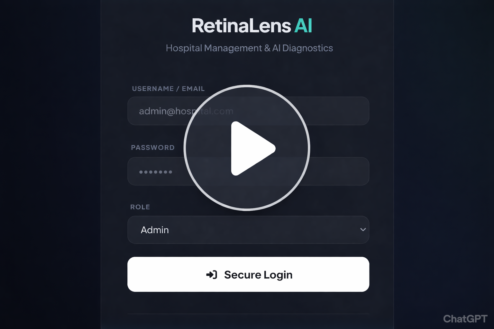

# 👁️ Diabetic Retinopathy Detection Using EfficientNet on Fundus Images

**Core Stack:** Python (PyTorch) · Deep Learning · Medical Image Classification · Fundus Photography  
**Model:** EfficientNet-B0  
**Dataset:** APTOS 2019 Blindness Detection
---
## Overview

This project presents a deep learning–based automated **diabetic retinopathy (DR)** severity grading system using color fundus images and the **EfficientNet-B0** architecture.

The model performs **multi-class classification** across five clinically defined severity stages:

- 0 — No DR  
- 1 — Mild  
- 2 — Moderate  
- 3 — Severe  
- 4 — Proliferative DR  

Diabetic retinopathy is one of the leading causes of preventable blindness worldwide. Early automated detection enables scalable screening programs, particularly in underserved regions with limited access to ophthalmologists.

This work delivers:

- A reproducible deep learning pipeline  
- Strong validation performance using AUC as the primary metric  
- Structured checkpointing for training stability  
- A deployable **web application** for real-time inference  
- Integrated **Grad-CAM** explainability for visual interpretation  

---
## Clinical Context

DR grading involves identifying pathological retinal features such as:

- Microaneurysms  
- Hemorrhages  
- Hard exudates  
- Cotton wool spots  
- Neovascularization  

Manual grading is time-intensive and requires trained specialists. AI-assisted systems can support:

- Large-scale screening  
- Early detection  
- Clinical decision support  
- Triage prioritization  

This project demonstrates the feasibility of high-performance DR classification using a computationally efficient CNN.

---
## Dataset

**APTOS 2019 Blindness Detection** (Kaggle)  

The dataset contains labeled fundus images graded on a 0–4 DR severity scale.

> ⚠️ **Note:** Dataset not included in this repository.  
> Download from: [Kaggle – APTOS 2019 Blindness Detection](https://www.kaggle.com/c/aptos2019-blindness-detection/data)

---
## Data Preparation & Split

The dataset was split as follows:

- **Training Set:** 2,929 images  
- **Validation Set:** 723 images  
- No separate held-out test evaluation performed  

Stratified splitting was used to preserve class distribution across subsets.

---
## Methodology

### Image Preprocessing

- Resize to **224 × 224**  
- 3-channel RGB input  
- ImageNet normalization  
- Tensor conversion via PyTorch transforms  

### Data Augmentation

Applied during training to improve generalization:

- Random horizontal flipping  
- Random rotation  
- Brightness and contrast adjustments  

### Model Architecture

**EfficientNet-B0**  

EfficientNet applies compound scaling across:

- Network depth  
- Network width  
- Input resolution  

Key properties:

- Pretrained on ImageNet  
- Lightweight and computationally efficient  
- Strong performance-to-parameter ratio  

The final classification layer was modified to output 5 DR severity classes.

---
## Training Details

- **Framework:** PyTorch + timm  
- **Loss Function:** Cross-Entropy Loss  
- **Optimizer:** Adam  
- **Learning Rate:** 1e-3  
- **Epochs:** 10  
- **Device:** CPU  
- **Checkpointing:** Best model saved based on validation AUC  

**Best model achieved at:**  
Epoch 8 — Validation AUC: 0.9960

---
## Results

Strong validation performance:

- **Validation AUC:** 99.60%  
- **Validation Accuracy:** 98.23%  
- **Validation F1 Score:** 98.27%  

These results indicate strong discriminative performance across DR severity levels.  
**Note:** Metrics reflect internal validation performance only.

  

---
## Evaluation Metrics

- **AUC** (Area Under ROC Curve) — Primary metric  
- **Accuracy**  
- **F1 Score**  

AUC was selected due to:

- Sensitivity to class imbalance  
- Clinical relevance  
- Robust discrimination assessment  

---
## Explainability with Grad-CAM

### Why Explainability Matters

In medical AI, predictive accuracy alone is insufficient. Clinical systems must provide transparency and interpretability.

### What is Grad-CAM?

Gradient-weighted Class Activation Mapping highlights image regions most influential in the model’s prediction.

Implementation:

- Gradients extracted from the final convolutional block  
- Class-specific importance weights computed  
- Heatmap generated and resized  
- Overlay applied using OpenCV  
- Output displayed in the web interface  

### Clinical Relevance

Grad-CAM allows verification that the model focuses on:

- Retinal lesion regions  
- Pathologically relevant features  
- Clinically meaningful patterns  

This enhances interpretability and trust in the AI system.

---
## Web Application

A lightweight **Flask**-based web application enables:

- Uploading a fundus image  
- Real-time DR severity prediction  
- Display of predicted class  
- Confidence score output  
- **Grad-CAM** heatmap visualization  

This simulates a simplified AI-assisted screening workflow.

Run locally with:  
`python webapp.py` (or `flask run`)

---
## Model Checkpointing & Reproducibility

- `best_model.pth` saved at highest validation AUC  
- Modular training pipeline  
- Deterministic structure for reproducibility  

---
## Limitations

- No external test set evaluation  
- No cross-dataset generalization study  
- CPU-based training (limited epochs)  
- Limited augmentation strategies  
- No real-world clinical validation  

---
## Future Work

- External dataset validation  
- Class-weighted loss for imbalance handling  
- Larger EfficientNet variants (B3/B4)  
- Cloud deployment (Hugging Face / Render / AWS)  
- Structured clinical report generation  
- Integration into a broader hospital AI system  

---
## Ethical Considerations

- For research and educational purposes only  
- Not validated for clinical diagnosis  
- Should not replace professional ophthalmologic assessment  
- Requires regulatory approval for real-world deployment  

---
## Disclaimer

This system is intended **strictly for research and educational use**.  
It is **not approved** for clinical diagnosis.

---
## Demo

### Demo Video

  

---
**Author**  
Angel Egwaoje  
Medical AI Research & Development
